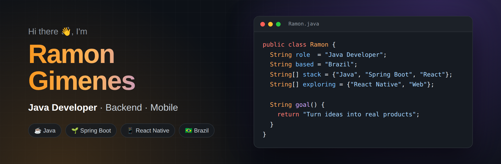
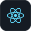
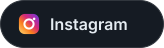

 

 

## 👨‍💻 About me

Brazilian developer focused on **Java**, always exploring new technologies and building
practical solutions. I'm improving my skills in **backend**, **frontend** and **mobile** with
**React Native**, and my goal is simple: keep evolving and turn ideas into real products.

- ☕ Building backends with **Java** and **Spring Boot**
- 📱 Learning **React Native** and modern web development
- 🍅 Currently building [**Fokus**](https://github.com/ramongime/Fokus), a Pomodoro app for focus
- 💡 I like solutions that are simple, useful and easy to use

 

## 🧰 Tech stack

<table>
  <tr>
    <td align="center" width="120"><b>Backend</b></td>
    <td>
      
      
       Java · Spring Boot · REST APIs · SQL
    </td>
  </tr>
  <tr>
    <td align="center"><b>Frontend</b></td>
    <td>
      
      
      
      
       HTML · CSS · JavaScript · React
    </td>
  </tr>
  <tr>
    <td align="center"><b>Mobile</b></td>
    <td>
      
      
       React Native · Expo
    </td>
  </tr>
  <tr>
    <td align="center"><b>Tools</b></td>
    <td>
      
      
      
      
       Git · GitHub · IntelliJ IDEA · VS Code
    </td>
  </tr>
</table>

 

## 🚀 Featured project

### [🍅 Fokus](https://github.com/ramongime/Fokus)

A minimalist **Pomodoro timer + task list** built with **React Native and Expo**.

- ⏱️ Keeps counting with the screen locked and notifies (and vibrates) when each cycle ends
- 🔁 Auto-chains focus and breaks, with a long break every few focus sessions
- 🎯 Link a task to your focus session and track pomodoros per task
- 📊 Weekly history with a chart, focused time and day streak
- 🧪 Tested business logic, lint and CI on every push

 

## 🐍 Contribution activity

<picture>
  <source media="(prefers-color-scheme: dark)" srcset="https://raw.githubusercontent.com/ramongime/ramongime/output/github-snake-dark.svg">
  <source media="(prefers-color-scheme: light)" srcset="https://raw.githubusercontent.com/ramongime/ramongime/output/github-snake.svg">
  
</picture>

 

## 🤝 Let's connect

  

**Thanks for stopping by!** Feel free to explore my repositories and follow my journey 🚀

