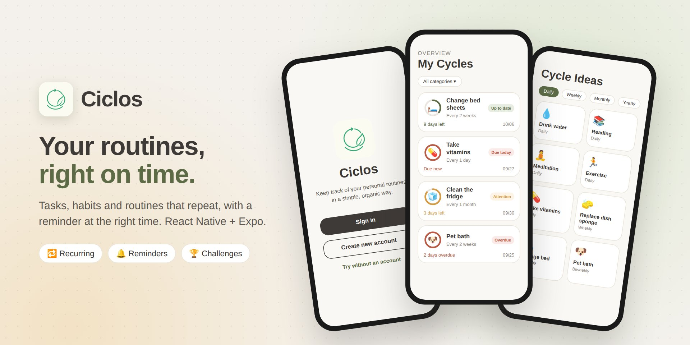
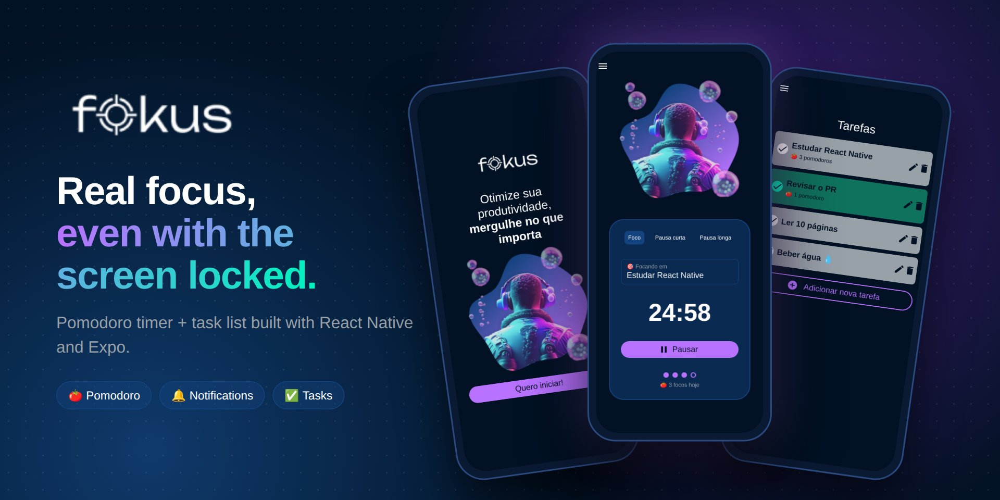

 

 

## 👨‍💻 About me

**Senior Java developer** from Brazil with **9 years of experience** building backends with
**Java and Spring Boot**. I also build mobile apps with **React Native**, and I like solutions
that are simple, useful and easy to use: code matters, but the solved problem is what counts.

- ☕ 9 years building backends with **Java** and **Spring Boot**
- 🧩 Microservices, relational and NoSQL databases, messaging and cloud
- 📱 Creator of [**Ciclos**](https://ciclosapp.com.br/) and [**Fokus**](https://github.com/ramongime/Fokus), built with React Native
- 💡 Simple, useful and easy to use: that's the goal

 

## 🧰 Tech stack

<table>
  <tr>
    <td align="center" width="120"><b>Backend</b></td>
    <td>
      
      
      
      
       Java · Spring Boot · Hibernate · Quarkus · REST APIs
    </td>
  </tr>
  <tr>
    <td align="center"><b>Data</b></td>
    <td>
      
      
      
      
       SQL · PostgreSQL · MongoDB · Redis · Kafka
    </td>
  </tr>
  <tr>
    <td align="center"><b>Frontend</b></td>
    <td>
      
      
      
      
       HTML · CSS · JavaScript · React
    </td>
  </tr>
  <tr>
    <td align="center"><b>Mobile</b></td>
    <td>
      
      
       React Native · Expo
    </td>
  </tr>
  <tr>
    <td align="center"><b>Infra</b></td>
    <td>
      
      
      
       Docker · Kubernetes · AWS · CI/CD
    </td>
  </tr>
  <tr>
    <td align="center"><b>Tools</b></td>
    <td>
      
      
      
      
       Git · GitHub · IntelliJ IDEA · VS Code
    </td>
  </tr>
</table>

 

## 🚀 Featured projects

### [♻️ Ciclos](https://ciclosapp.com.br/)

A mobile app to manage **recurring tasks, habits and routines**, built with **React Native and Expo**.

- 🔁 Cycles with flexible intervals, from hours to years, renewed with one tap
- 🔔 Local reminders before a cycle is due and when it's overdue
- 🏆 Challenges with invite codes, a consistency ranking and a monthly global challenge
- 💡 Ready-made suggestions, categories, light and dark themes, in Portuguese, English and Spanish
- 💎 Premium plan with RevenueCat and ads with AdMob

 

### [🍅 Fokus](https://github.com/ramongime/Fokus)

A minimalist **Pomodoro timer + task list** built with **React Native and Expo**.

- ⏱️ Keeps counting with the screen locked and notifies (and vibrates) when each cycle ends
- 🔁 Auto-chains focus and breaks, with a long break every few focus sessions
- 🎯 Link a task to your focus session and track pomodoros per task
- 📊 Weekly history with a chart, focused time and day streak
- 🧪 Tested business logic, lint and CI on every push

 

## 🐍 Contribution activity

<picture>
  <source media="(prefers-color-scheme: dark)" srcset="https://raw.githubusercontent.com/ramongime/ramongime/output/github-snake-dark.svg">
  <source media="(prefers-color-scheme: light)" srcset="https://raw.githubusercontent.com/ramongime/ramongime/output/github-snake.svg">
  
</picture>

 

## 🤝 Let's connect

  

**Thanks for stopping by!** Feel free to explore my repositories and follow my journey 🚀

