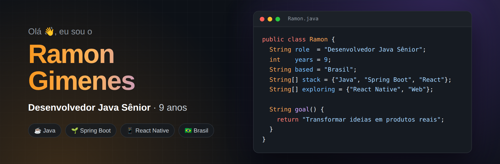
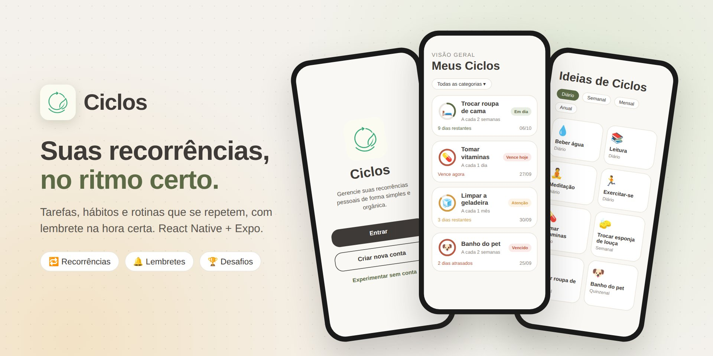
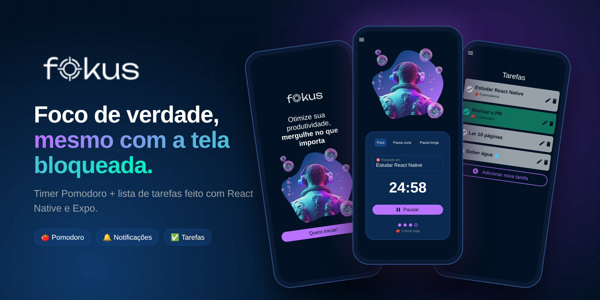

  <a href="https://github.com/ramongime"> English</a> &nbsp;·&nbsp;  <b>Português</b>

 

 

## 👨‍💻 Sobre mim

**Desenvolvedor Java sênior**, brasileiro, com **9 anos de experiência** construindo backends com
**Java e Spring Boot**. Também crio apps mobile com **React Native**, e gosto de soluções simples,
úteis e fáceis de usar: o código importa, mas o que vale é o problema resolvido.

- ☕ 9 anos construindo backends com **Java** e **Spring Boot**
- 🧩 Microserviços, bancos relacionais e NoSQL, mensageria e nuvem
- 📱 Criador do [**Ciclos**](https://ciclosapp.com.br/) e do [**Fokus**](https://github.com/ramongime/Fokus), feitos com React Native
- 💡 Simples, útil e fácil de usar: esse é o objetivo

 

## 🧰 Tecnologias

<table>
  <tr>
    <td align="center" width="120"><b>Backend</b></td>
    <td>
      
      
      
      
       Java · Spring Boot · Hibernate · Quarkus · REST APIs
    </td>
  </tr>
  <tr>
    <td align="center"><b>Dados</b></td>
    <td>
      
      
      
      
       SQL · PostgreSQL · MongoDB · Redis · Kafka
    </td>
  </tr>
  <tr>
    <td align="center"><b>Frontend</b></td>
    <td>
      
      
      
      
       HTML · CSS · JavaScript · React
    </td>
  </tr>
  <tr>
    <td align="center"><b>Mobile</b></td>
    <td>
      
      
       React Native · Expo
    </td>
  </tr>
  <tr>
    <td align="center"><b>Infra</b></td>
    <td>
      
      
      
       Docker · Kubernetes · AWS · CI/CD
    </td>
  </tr>
  <tr>
    <td align="center"><b>Ferramentas</b></td>
    <td>
      
      
      
      
       Git · GitHub · IntelliJ IDEA · VS Code
    </td>
  </tr>
</table>

 

## 🚀 Projetos em destaque

### [♻️ Ciclos](https://ciclosapp.com.br/)

App mobile para gerenciar **tarefas, hábitos e rotinas recorrentes**, feito com **React Native e Expo**.

- 🔁 Ciclos com intervalos flexíveis, de horas a anos, renovados com um toque
- 🔔 Lembretes antes de um ciclo vencer e quando ele atrasa
- 🏆 Desafios com código de convite, ranking de constância e um desafio global todo mês
- 💡 Sugestões prontas, categorias, tema claro e escuro, em português, inglês e espanhol
- 💎 Plano premium com RevenueCat e anúncios com AdMob

 

### [🍅 Fokus](https://github.com/ramongime/Fokus)

Um **timer Pomodoro + lista de tarefas** minimalista, feito com **React Native e Expo**.

- ⏱️ Continua contando com a tela bloqueada e avisa (e vibra) no fim de cada ciclo
- 🔁 Emenda foco e pausas sozinho, com pausa longa a cada alguns focos
- 🎯 Vincula uma tarefa ao foco e conta os pomodoros de cada tarefa
- 📊 Histórico da semana com gráfico, tempo focado e sequência de dias
- 🧪 Regras de negócio testadas, lint e CI a cada push

 

## 🐍 Atividade de contribuições

<picture>
  <source media="(prefers-color-scheme: dark)" srcset="https://raw.githubusercontent.com/ramongime/ramongime/output/github-snake-dark.svg">
  <source media="(prefers-color-scheme: light)" srcset="https://raw.githubusercontent.com/ramongime/ramongime/output/github-snake.svg">
  
</picture>

 

## 🤝 Vamos conversar

  

**Valeu pela visita!** Fique à vontade para explorar meus repositórios e acompanhar minha jornada 🚀

